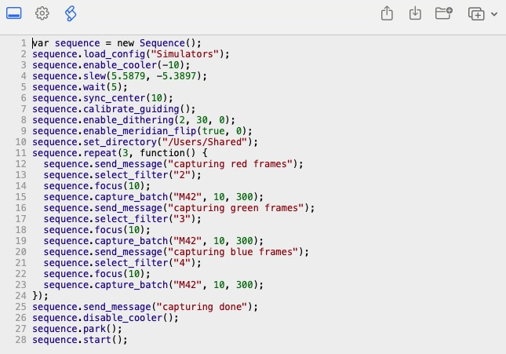

#  INDIGO Script based Sequencer

## License

INDIGO Astronomy open-source license.

## Use

Before the first sequence is created, content of [Sequencer.js](Sequencer.js) file must be executed as a script by setting it to the value of AGENT\_SCRIPTING\_RUN\_SCRIPT\_ITEM in AGENT\_SCRIPTING\_RUN\_SCRIPT\_PROPERTY.

## State: under development

## Public API

To create sequence, create Sequence instance like this

```
var sequence = new Sequence(); 
```

Then add sequence steps by calling helper methods like this

```
sequence.load_config("Simulators");
sequence.enable_cooler(-10);
sequence.slew(5.5879, -5.3897);
sequence.wait(5);
sequence.sync_center(10);
sequence.calibrate_guiding();
sequence.enable_dithering(2, 30, 0);
sequence.enable_meridian_flip(true, 0);
sequence.set_directory("/Users/Shared");
sequence.send_message("capturing red frames");
sequence.select_filter("2");
sequence.focus(10);
sequence.capture_batch("M42", 10, 300);
sequence.send_message("capturing green frames");
sequence.select_filter("3");
sequence.focus(10);
sequence.capture_batch("M42", 10, 300);
sequence.send_message("capturing blue frames");
sequence.select_filter("4");
sequence.focus(10);
sequence.capture_batch("M42", 10, 300);
sequence.send_message("capturing done");
sequence.disable_cooler();
sequence.park();
```

A full list of helper methods can be found in Sequencer.js file. Note that calling sequence method doesn't execute sequence step, it just create item for the step in internal array containing actual step code, its index for identifying step withing GUI etc. 

Sequence can also contain a loop using repeat helper method with repeat count and anonymous function containing loop body like this

```
sequence.repeat(3, function() {
	sequence.send_message("capturing red frames");
	sequence.select_filter("2");
	sequence.focus(10);
	sequence.capture_batch("M42", 10, 300);
	sequence.send_message("capturing green frames");
	sequence.select_filter("3");
	sequence.focus(10);
	sequence.capture_batch("M42", 10, 300);
	sequence.send_message("capturing blue frames");
	sequence.select_filter("4");
	sequence.focus(10);
	sequence.capture_batch("M42", 10, 300);
});

```

Sequence can be executed like this:

```
sequence.start();
```

Once sequence is started, it creates three properties on "Sequencer agent" device:

Read only number vector SEQUENCE\_STATE with STEP item containing the currently executed step (zero based index). State of this property represents state of the executed sequence (Ok = finished, Busy = executed, Alert = failed). If the property is in Alert state, STEP item contains the index of failed step. In GUI all steps with index lower than STEP item value can be marked as done, all steps with index higher as STEP item value as idle and step with index equal to STEP item value either as executed (if property is in Busy state) or failed (if property is in Alert state).

Read-write switch vector SEQUENCE\_RESET with RESET item. This resets the state of SEQUENCE\_STATE property, e.g. if the sequence is being edited by GUI code.

Read-write switch vector AGENT\_ABORT\_PROCESS with AGENT\_ABORT\_PROCESS item. This aborts execution of the sequence.

## Examples of visual representation of a sequence in GUI (pre-release of INDIGO A1v5)

 
 
 
